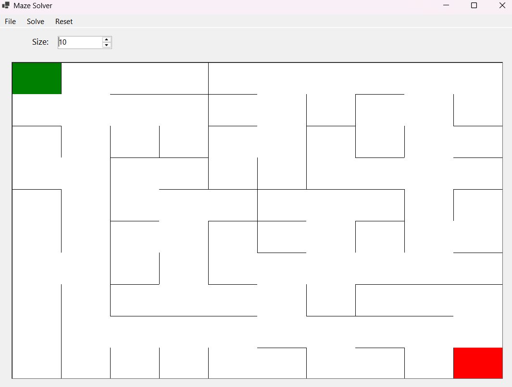
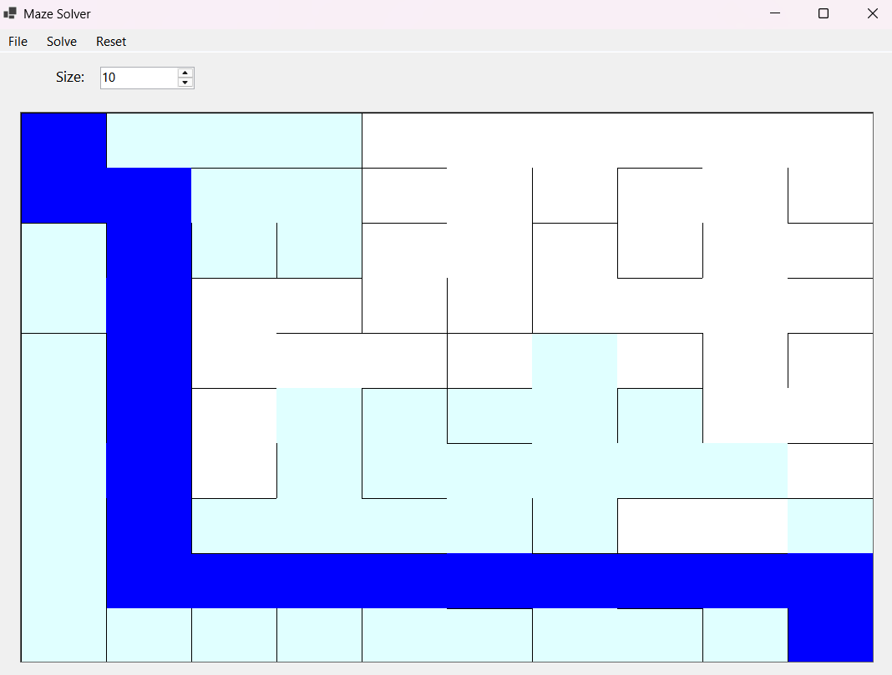
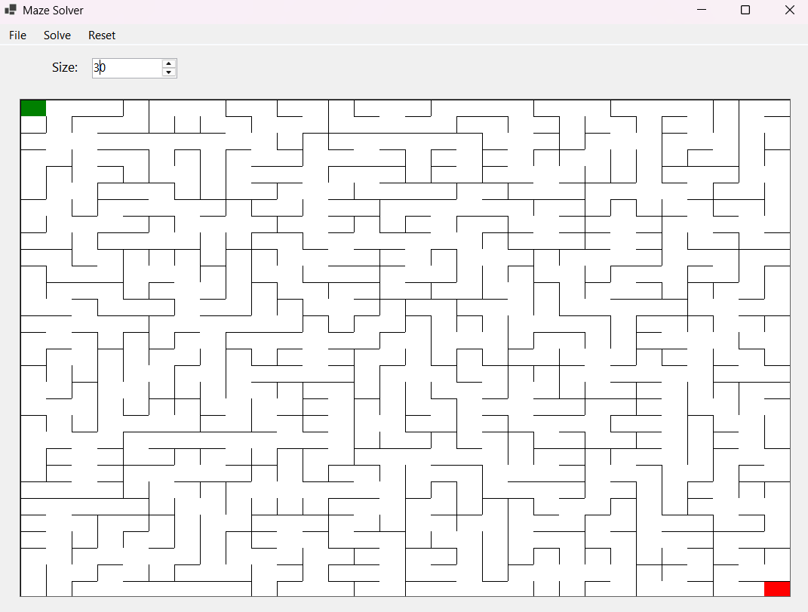
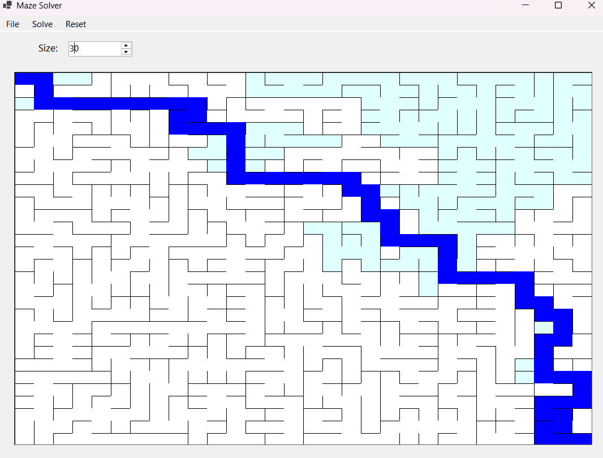

# Maze Generator and Solver
This is a simple maze generator and solver created as a Winforms App with C#.
The maze is generated using Kruskal's algorithm and solved using the BFS (Breadth-First Search) and DFS (Depth-First Search).
The size of the maze can be adjusted and the maze can be generated and solved using the menu buttons.
Default size of maze is 10x10.

## Maze Generation
The maze is generated using Kruskal's algorithm. 
The algorithm works by creating a grid of cells and walls. 
Each cell is a node and each wall is an edge. 
The algorithm then randomly selects a wall and checks if the cells on either side of the wall are in the same set. 
If they are not in the same set, the wall is removed and the cells are unionized into the same set. 
This process is repeated until all cells are in the same set. It used the Union-Find data structure to keep track of the sets.

## Maze Solving
The maze is solved using BFS (Breadth-First Search) and DFS (Depth-First Search).
Both algorithms work by traversing the maze from the start cell to the end cell.
BFS uses a queue to keep track of the cells to visit next, while DFS uses a stack.

## Screenshots
### 10x10 Maze

### 30x30 Maze

